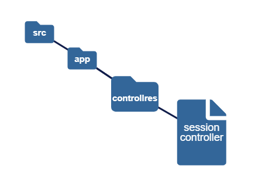
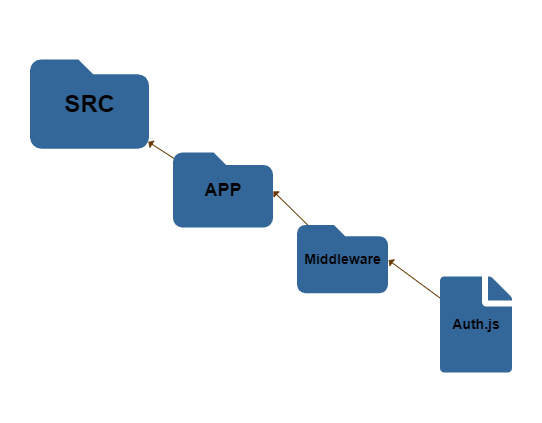

### Login Auth Token TDD

Aplicação de login e authenticação usando boas praticas de arquitetura, clean code e testes unitarios TDD.

> Dependencias do _**[package.json]:**_

```
"dependencies": {
  "bcryptjs": "^2.4.3",
   "dotenv": "^16.0.3",
   "express": "^4.18.2",
   "factory-girl": "^5.0.4",
   "faker": "^6.6.6",
   "jsonwebtoken": "^8.5.1",
   "mariadb": "^3.0.2",
   "pg": "^8.8.0",
   "sequelize": "^6.25.8"
 },
 "devDependencies": {
   "jest": "^29.3.1",
   "nodemon": "^2.0.20",
   "sequelize-cli": "^6.5.2",
   "sqlite3": "^5.1.2",
   "supertest": "^6.3.1"
 }
```

> Utilizando:

`bcryptjs` para criar hash de senha alternativo
e usando `bcryptjs.compare` para comparar as senhas
hash dos testes com o banco de dados

`jsonwebtoken` para decotificar token de cada usuario criado

`dotenv` para ultilizar variáveis de ambiente
de arquivo `.env`

Variaveis de ambiente utilizadas no projeto 👇🏻

> #### .env

```
APP_SECRET
DATABASE
DATABASE_DIALECT
DATABASE_HOST
DATABASE_PORT
DATABASE_USERNAME
DATABASE_PASSWORD
```

> #### .env.test

```
APP_SECRET
DATABASE_DIALECT

```

`express` e `nodemon` pra conexão e rotas

utilizando controllers para rotas de teste 👇🏻



---

> Utilizando Middleware para autenticar rotas 👇🏻



Banco de dados Mysql com `mariadb` integrado em
instancias de vm no google cloud em um container
de docker

`sequelize-cli` para criar migrates para db

`jest` para testes TDD

em `jest.config.js` habilitado modo _coverageDirectory_ 👇🏻


[coverage-file](./__tests__/coverage/lcov-report/index.html)

`sqlite3` para armazenar migrates de teste em desenvolvimento

`factory-girl` parar criar factorys _**'fabricas novas'**_

`faker` para criar dados fictícios para os testes

Feita configuração no `"scripts":` para os testes 👇🏻

```
 "scripts": {
    "start": "node src/server.js",
    "dev": "nodemon src/server.js --ignore __tests__",
    "pretest": "ENV=test sequelize db:migrate",
    "test": "ENV=test jest",
    "posttest": "ENV=test sequelize db:migrate:undo:all"
  },

```
